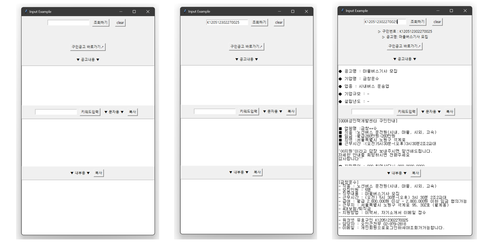

## 직업상담사를 위한 워크넷 구인공고 안내용 문자 제작 프로그램 

<br>


1. tkinter 사용
2. 구인번호 입력 >> 워크넷 채용공고 정보 조회 >>  구인 안내용 문자 제작
3. exe 파일 제작 후 배포





```python
import tkinter as tk
import pyperclip

import webbrowser
import re
import random
import pandas as pd

import requests
from html_table_parser import parser_functions
from bs4 import BeautifulSoup

url = 'https://www.work.go.kr/empInfo/empInfoSrch/detail/empDetailAuthView.do?searchInfoType=VALIDATION&callPage=detail&wantedAuthNo='
url_link = 'https://www.work.go.kr/seekWantedMain.do'

def copy_text1():
    pyperclip.copy(output_display2.get("1.0", "end-1c"))

def copy_text2():
    pyperclip.copy(output_display3.get("1.0", "end-1c"))

def open_url():
    webbrowser.open_new(url_link)

def clear_text():
    input_field.delete(0, 'end')
    input_field2.delete(0, 'end')
    output_display1.config(state="normal")
    output_display1.delete("1.0", "end")
    output_display2.config(state="normal")
    output_display2.delete("1.0", "end")
    output_display3.config(state="normal")
    output_display3.delete("1.0", "end")    
    
    search_display.config(text="")
    search_display2.config(text="")
    
    global url_link
    url_link = 'https://www.work.go.kr/seekWantedMain.do'

def get_input():
    output_display1.config(state="normal")
    output_display1.delete("1.0", "end")
    output_display2.config(state="normal")
    output_display2.delete("1.0", "end")
    output_display3.config(state="normal")
    output_display3.delete("1.0", "end")
 
    global input_value
    input_value = input_field.get()
    
    global url_link
    url_link = url+input_value
    
    try :
        req = requests.get(url_link)
        html = req.text
        soup = BeautifulSoup(html, 'html.parser')

        #채용공고 제목
        title = soup.find('p', {'class' : 'tit'})
        title_text = title.get_text()

        # 회사정보
    
        company_info = soup.select('div.right > div.info > ul > li > div')
        com_name = company_info[0].text.strip()
        com_type = company_info[1].text.strip()
        com_size = '-' if company_info[2].text.strip()=='' else company_info[2].text.strip()
        com_year = '-' if company_info[3].text.strip()=='' else company_info[3].text.strip()
        com_sales = '-' if company_info[4].text.strip()=='' else company_info[4].text.strip()
        com_workers = '-' if company_info[6].text.strip()=='' else company_info[6].text.strip()

        # careers-new
        job_info = soup.select('div.cont > ul > li > span')

        # 임금
        job_info_sal = job_info[3].get_text().strip().replace('\n','').replace(' ', '')

        # 직무내용 표
        data1 = soup.find('div', {'class' : 'careers-table'})
        d1_table1 = parser_functions.make2d(data1)

        # 직무내용
        d1_table1_job_des =  parser_functions.make2d(data1)[1][0].replace(u'*\xa0', '\n*').replace(u'-\xa0', '\n-').replace('\r  ','\n').replace('\r ','\n').replace(u'\xa0', ' ').replace('\r','\n').strip()
        job_des = re.sub(' +', ' ', d1_table1_job_des)

        # 구직정보 가져오기
        data2 = soup.find_all("div", {'class' : 'careers-table v1 center mt20'})

        # 모집요강 표1. 경력조건, 학력, 고용형태, 모집인원, 근무예정지 항목으로 구성
        table1 = parser_functions.make2d(data2[0])
        table1_df = pd.DataFrame(data=table1[1:], columns = table1[0])

        # 경력조건
        job_con = table1_df['경력조건'][0].replace(u'\xa0', ' ').replace(' ','').replace('\n','')

        # 학력
        job_edu = table1_df['학력'][0].replace(u'\xa0', ' ').replace(' ','').replace('\n','')
        job_type = table1_df['고용형태'][0].replace(u'\xa0', ' ').replace(' ','').replace('\n','')

        # 모집인원
        job_to_find = table1_df['모집인원'][0].find('\t')
        job_to = table1_df['모집인원'][0][:job_to_find]

        # 근무지역
        job_place = re.sub(' +', ' ', table1_df['근무예정지'][0].replace(u'\xa0', ' ').replace('\n', ' '))
        
        # 모집요강 표2. 모집직종, 직종키워드, 관련직종 항목으로 구성
        table2 = parser_functions.make2d(data2[1])
        table2_df = pd.DataFrame(data=table2[1:], columns = table2[0])

        # 모집직종
        job_name = table2_df.iloc[0,0]

        # 근무조건 표. 임금조건, 근무시간, 근무형태, 사회보험, 퇴직급여 항목으로 구성
        data3 = soup.find("div", {'class' : 'careers-table center'})
        table3 = parser_functions.make2d(data3)
        table3_df = pd.DataFrame(data=table3[1:], columns = table3[0])

        # 임금조건
        job_sal = table3_df.iloc[0,0].replace('\n','')
        job_sal = re.sub(' +', ' ', job_sal)

        # 근무시간
        job_time = table3_df['근무시간'][0].replace(u'\xa0', ' ')
        job_time = job_time[:job_time.find('주 소정근로시간')]
        job_time = job_time.replace('\n','').replace('\t','')
        job_time = re.sub(' +', ' ', job_time).replace('근무시간 협의가능 ','').replace('※ 상세 근무시간 ', '').replace('\r','\n')

        job_time2 = job_time[:job_time.find('퇴근')].strip() + job_time[job_time.find('퇴근'):job_time.find('퇴근')*2].strip()
        job_time2 = job_time2[:None if job_time2.find('(휴게시간')==-1 else job_time2.find('(휴게시간')]
        job_time2 = job_time2[:None if job_time2.find('휴게시간')==-1 else job_time2.find('휴게시간')]
        job_time2 = job_time2.replace(' ' ,'')

        # 근무형태
        job_form = table3_df['근무형태'][0]

        # 업체명
        replace_name = [' ', '주식회사', '(주)', '(유)', '법무법인', '사단법인', '세무법인', '유한책임회사', '(재)']
        num = random.choice(range(2,7,1))*"*"

        for i in replace_name:
            com_name = com_name.replace(i, '')
            
        if len(com_name) == 2:
            com_name2 = com_name[:1]+num
        elif len(com_name) == 3:
            com_name2 = com_name[:1]+num+com_name[-1]
        elif len(com_name) == 4:
            com_name2 = com_name[:2]+num+com_name[-1]
        else:
            com_name2 = com_name[:2]+num+com_name[len(com_name)-2:len(com_name)] 

        # 담당자 테이블
        job_manager = soup.find('div', {'class' : 'careers-table charge center mb30'})
        job_manager = parser_functions.make2d(job_manager)
        job_manager_df = pd.DataFrame(data = job_manager[1:], columns = job_manager[0])

        # 담당자 이름
        job_manager_name = job_manager_df['담당자'][0].replace(' ','').replace('\n','')
        job_manager_name

        # 담당자 전화
        job_manager_num = job_manager_df['전화번호'][0].replace(' ','').replace('\n','')

        # 담당자 휴대폰번호
        job_manager_ph_num = job_manager_df['휴대폰번호'][0].replace(' ','').replace('\n','')

        # 담당자 팩스번호
        job_manager_fx_num = job_manager_df['팩스번호'][0].replace(' ','').replace('\n','')

        # 담당자 이메일
        job_manager_email = job_manager_df['이메일'][0].replace(' ','').replace('\n','')

        # 지원방법 테이블
        job_submit = soup.find_all('div',{'class':'careers-table center'})[1]
        job_submit = parser_functions.make2d(job_submit)
        job_submit_df = pd.DataFrame(data = job_submit[1:], columns = job_submit[0])

        # 전형방법
        recruit_method = job_submit_df['전형방법'][0].replace(u'\xa0', ' ').replace('\n','').replace(' ','')

        # 접수방법
        submit_method = job_submit_df['접수방법'][0].replace(u'\xa0', ' ').replace('\n','').replace('\t','').replace(' ','').replace('채용정보제공사이트로이동','')

        # 제출서류 준비물
        submit_doc = job_submit_df['제출서류 준비물'][0].replace(u'\xa0', ' ').replace('\n','').replace('\t','').replace(' ','').replace('채용정보제공사이트로이동','')

        if len(input_field2.get() ) == 0:
            input_value2 = 'OO지원'
        else:
            input_value2 = input_field2.get()

        display_string1 = ( "\n"
                        +"● 공고명 : " + title_text + "\n\n"
                        + "● 기업명 : " + com_name + "\n\n"
                        + "● 업종 : " + com_type + "\n\n"
                        + "● 기업규모 : " + com_size + "\n\n"
                        + "● 설립년도 : " + com_year + "\n\n"
                        + "● 연매출액 : " + com_sales + "\n\n"
                        + "● 근로자수 : " + com_workers + "\n\n"
                        + "● 모집직종\n" + job_name + "\n\n"
                        + "● 근무예정지\n" + job_place + "\n\n"
                        + "● 임금조건(요약)\n" + job_info_sal + "\n\n"
                        + "● 임금조건(상세)\n" + job_sal + "\n\n"
                        + "● 근무시간\n" + job_time + "\n\n"
                        + "● 근무형태\n" + job_form + "\n\n"
                        + "● 경력조건\n" + job_con + "\n\n"
                        + "● 학력\n" + job_edu + "\n\n"
                        + "● 고용형태\n" + job_type + "\n\n"
                        + "● 모집인원\n" + job_to + "\n\n"
                        + "● 직무내용\n" + job_des
                        )    
        
        display_string2 = ("[00여성인력개발센터 구인안내]" + "\n\n"
                        + "■ 업체명 :" + com_name2 + "\n"
                        + "■ 직종 :" + job_name + "\n"
                        + "■ 임금 :" + job_info_sal + "\n"
                        + "■ 지역 :" + job_place[:[m.start() for m in re.finditer(r" ", job_place)][2]] + "\n"
                        + "■ 근무시간 :" + job_time2 + "\n"
                        + "\n"
                        + f'"{input_value2}"이라고 답장 보내주시면 알선해드립니다.' + "\n"
                        + "자세한 안내를 희망하시면 전화주세요" + "\n"
                        + "감사합니다^^" + "\n"
                        + "\n"
                        + "☎ 지원문의 : 000 취업상담사 000-0000-0000"
                        ) 
        
        display_string3 = ('[' + com_name + ']' + "\n"
                        + "- 직종 : " + job_name + "\n"
                        + "- 모집인원 : " + job_to + "\n"
                        + "- 직무내용 : " + title_text + "\n"
                        + "- 근무시간 : " + job_time + "\n"
                        + "- 급여 : " + job_sal + "\n"
                        + "- 근무지 : " + job_place + "\n"
                        + "- 4대보험/퇴직금" + "\n"
                        + "- 지원방법 : 이력서, 자기소개서 이메일 접수" + "\n"
                        + "---------------------------------" + "\n"
                        + "- 워크넷 유효구인 " + input_value + "\n"
                        + "- 담당자 : " + job_manager_name + " " + job_manager_num + "\n"
                        + "- 이메일 : " + job_manager_email
                        )
                
        output_display1.insert("1.0", display_string1)
        output_display2.insert("1.0", display_string2)
        output_display3.insert("1.0", display_string3)
        
        search_display.config(text = f'▷ 구인번호 : {input_value}')
        search_display2.config(text = f'▷ 공고명: {title_text}')
                          
    except :
        output_display1.insert("1.0", "조회되지 않습니다. 구인번호를 다시 입력해주세요")
        label_display.config(text="Error!") 

                                 
root = tk.Tk()
root.title("Input Example")

# input_filed 옆에 submit_button을 배치

input_frame = tk.Frame(root)
input_frame.pack(pady=10)

input_field = tk.Entry(input_frame)
input_field.pack(side = 'left')

submit_button = tk.Button(input_frame, text="조회하기", command=get_input)
submit_button.pack(side = 'left', padx = 10)

submit_button2 = tk.Button(input_frame, text="clear", command= clear_text)
submit_button2.pack(side = 'left', padx = 10)

search_display = tk.Label(root, pady=0 )
search_display.pack(pady=0)
search_display2 = tk.Label(root, pady=0)
search_display2.pack(pady=0)

url_button = tk.Button(root, text="구인공고 바로가기↗", command=open_url)
url_button.pack(pady=10)

label_display2 = tk.Label(root)
label_display2.pack(pady=10)
label_display2.config(text="▼ 공고내용 ▼")

output_display1 = tk.Text(root, height=10, width=65 )
output_display1.pack(fill="both", expand=True)
output_display1.tag_configure("lineheight", spacing1=14.4)
output_display1.tag_add("lineheight", "1.2", "end")

input_frame2 = tk.Frame(root)
input_frame2.pack(pady=10)

input_field2 = tk.Entry(input_frame2)
input_field2.pack(side = 'left') 
    
ch_button1 = tk.Button(input_frame2, text="키워드입력", command= get_input)
ch_button1.pack(side = 'left', padx = 10)

label_display3 = tk.Label(input_frame2)
label_display3.pack(side = 'left')
label_display3.config(text="▼ 문자용 ▼")

copy_button1 = tk.Button(input_frame2, text="복사", command= copy_text1)
copy_button1.pack(side = 'left', padx = 10)

output_display2 = tk.Text(root, height=12, width=65  )
output_display2.pack(fill="both", expand=True)
output_display2.tag_configure("lineheight", spacing1=14.4)
output_display2.tag_add("lineheight", "1.2", "end")

input_frame3 = tk.Frame(root)
input_frame3.pack(pady=10)

label_display4 = tk.Label(input_frame3)
label_display4.pack(side = 'left')
label_display4.config(text="▼ 내부용 ▼")

copy_button2 = tk.Button(input_frame3, text="복사", command= copy_text2)
copy_button2.pack(side = 'left', padx = 10)

output_display3 = tk.Text(root, height=14, width=65  )
output_display3.pack(fill="both", expand=True)
output_display3.tag_configure("lineheight", spacing1=14.4)
output_display3.tag_add("lineheight", "1.2", "end")

root.mainloop()
```


