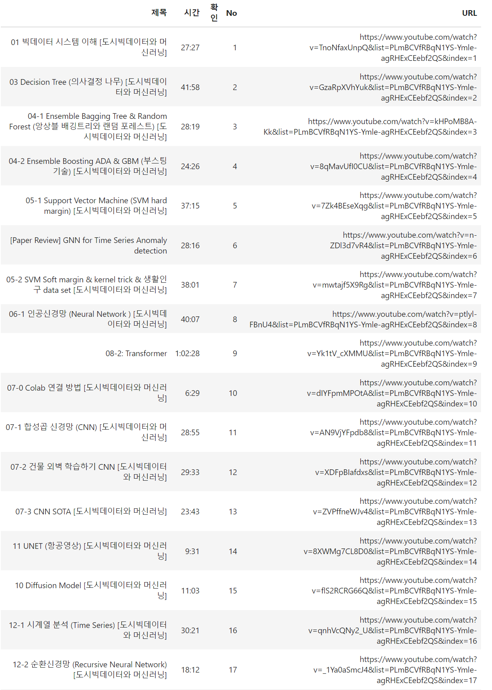

## 📌 [개인프로젝트] 유튜브 재생목록 리스트 크롤링

**※** **제작 배경 및 프로그램 설명** 

- 데이터사이언스 학습을 위해 유튜브 재생목록 리스트를 크롤링 하고, 학습 진행상황을 관리하기 위하여 제작하였습니다.
- 본인은 크롤링 된 결과를 노션과 같은 메모관리 어플에 복사하여 사용하고 있습니다.
- 해당 프로그램은 구글 코랩 기준으로 작업되었으며, 코랩 버젼 변경시 정상작동 되지 않을 수도 있습니다. 
- 저장소에서는 pyshortner가 적용되어 단축된 url이 출력되는 버젼과 그렇지 않은 버젼의 두가지 코드가 있습니다.
- README 파일은 URL이 그대로 출력되도록 되어있습니다.

  

```python
# 모듈 설치하기
!pip install selenium
!apt-get update
!apt install chromium-chromedriver
```

```python
# 웹 브라우저 작동을 위한 라이브러리
from selenium import webdriver
from urllib.request import urlopen
from bs4 import BeautifulSoup
from urllib.parse import quote_plus
from selenium.webdriver.common.keys import Keys

# 웹브라우저 작동을 기다리기 위한 라이브러리
import time
import random

# 시간 관련 라이브러리
from datetime import datetime, timedelta
from pytz import timezone

# IPython
from IPython.display import display

# 경고 무시
import warnings
warnings.filterwarnings(action='ignore')

# 데이터프레임 및 CSV 파일 저장을 위한 라이브러리
import pandas as pd

# 데이터프레임 출력
from tabulate import tabulate

# 크롬드라이버 option설정
options = webdriver.ChromeOptions()
options.add_argument('--headless')        # Head-less 설정
options.add_argument('--no-sandbox')
options.add_argument('--disable-dev-shm-usage')

def get_playlist(url, rep_text):

    # 브라우저 생성
    driver = webdriver.Chrome('chromedriver', options=options)

    # 웹사이트 열기
    driver.get(url)

    # 로딩이 끝날 때까지 2초 정도 기다림
    driver.implicitly_wait(2)

   # 안정적인 페이지 소스 추출을 위해 3초 정도 기다림
    time.sleep(3)

    # 페이지 소스 추출
    html_source = driver.page_source
    soup_source = BeautifulSoup(html_source, 'lxml')

    # 파싱정보 가져오기
    parsing = soup_source.find_all('a', class_ = 'yt-simple-endpoint style-scope ytd-playlist-video-renderer')
    video_time = soup_source.find_all('span', class_ ='style-scope ytd-thumbnail-overlay-time-status-renderer') #검색했을 때 검색숫자가 안맞아서 확인이 필요함

    # 파싱정보 정리하기
    name_list = []
    url_list = []
    time_list = []

    for i in range(len(parsing)):
        name_list.append(parsing[i].text.strip())
        main = 'https://www.youtube.com'
        sub = parsing[i].get('href')  
        url_list.append(f'{main}{sub}')
        time_list.append(video_time[i].text.strip())

   # 출력용 데이터 프레임 구성하기     
    playlist = {
        '제목' : name_list,
        '시간' : time_list,
        '확인' : '',    
        'No' : range(1, len(parsing)+1),
        'URL' : url_list, 
    }
   # 제목에서 제거할 문자 변환하기
    playlist = pd.DataFrame(playlist)
    playlist['제목'] = playlist['제목'].apply(lambda x: x.replace(rep_text,'').strip())

    return playlist
```

```python
# url 주소 입력
url = 'https://www.youtube.com/playlist?list=PLmBCVfRBqN1YS-Ymle-agRHExCEebf2QS'

# 재생목록 제목에서 제거할 텍스트(문자)를 입력
rep_text  = ''
```

```python
# 인덱스 제거해서 출력
get_playlist(url, rep_text).style.hide_index()
```



