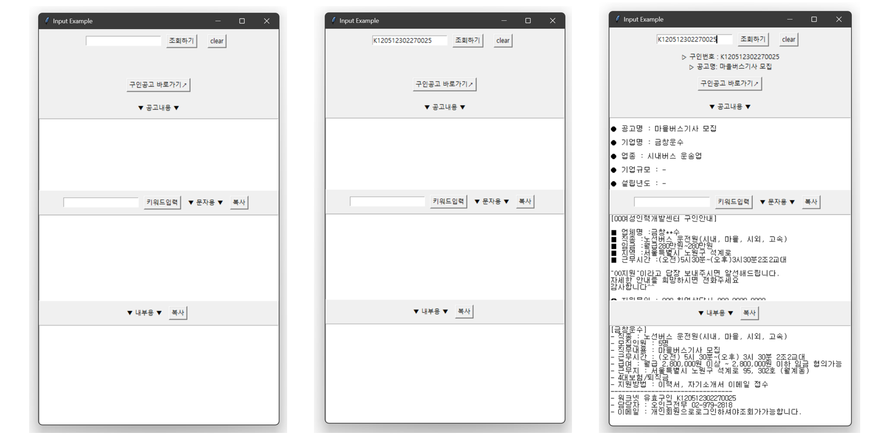

## 📂 <a href='https://github.com/countifs/portfolio'> BK21 테크니컬 포트폴리오 </a> : 데이터사이언스 공통

<br>

### 🚩 심사항목
| No. | 심사항목 | 내용 | 기타 |
|:----------:|----------|----------|----------|
|**1**|**데이터사이언스 공통**| **Python, SQL, R, Java, Scala, Go, C/C++, Javascript 등 데이터 처리 언어 활용 능력**  |<a href='https://github.com/countifs/portfolio/tree/main/1.%20%EB%8D%B0%EC%9D%B4%ED%84%B0%EC%82%AC%EC%9D%B4%EC%96%B8%EC%8A%A4%20%EA%B3%B5%ED%86%B5'>바로가기</a>|
|2|데이터 활용 및 분석| 데이터사이언스 관련 공모전 참여를 통한 공개 데이터의 활용 및 분석 능력  |<a href='https://github.com/countifs/portfolio/tree/main/2.%20%EB%8D%B0%EC%9D%B4%ED%84%B0%20%ED%99%9C%EC%9A%A9%20%EB%B0%8F%20%EB%B6%84%EC%84%9D'>바로가기</a>|
|3|데이터 시각화| Tableau, Power BI 등을 활용한 데이터 시각화 능력  |<a href='https://github.com/countifs/portfolio/tree/main/3.%20%EB%8D%B0%EC%9D%B4%ED%84%B0%20%EC%8B%9C%EA%B0%81%ED%99%94'>바로가기</a>|

<br>


### 📌 사이드 프로젝트

| No.  |        구분        | 프로젝트명                                                   | 비고 |
| :--: | :----------------: | ------------------------------------------------------------ | :--: |
|  1   | Web Crawling + GUI | 직업상담사를 위한 워크넷 구인공고 안내용 문자 제작 프로그램  |  <a href='https://github.com/countifs/portfolio/tree/main/1.%20%EB%8D%B0%EC%9D%B4%ED%84%B0%EC%82%AC%EC%9D%B4%EC%96%B8%EC%8A%A4%20%EA%B3%B5%ED%86%B5/8.%20%EC%A7%81%EC%97%85%EC%83%81%EB%8B%B4%EC%82%AC%EB%A5%BC%20%EC%9C%84%ED%95%9C%20%EC%9B%8C%ED%81%AC%EB%84%B7%20%EA%B5%AC%EC%9D%B8%EA%B3%B5%EA%B3%A0%20%EC%95%88%EB%82%B4%EC%9A%A9%20%EB%AC%B8%EC%9E%90%20%EC%A0%9C%EC%9E%91%20%ED%94%84%EB%A1%9C%EA%B7%B8%EB%9E%A8'>바로가기</a>   |
|  2   |    Web Crawling    | 유튜브 재생목록 크롤링                                       |  <a href='https://github.com/countifs/portfolio/tree/main/1.%20%EB%8D%B0%EC%9D%B4%ED%84%B0%EC%82%AC%EC%9D%B4%EC%96%B8%EC%8A%A4%20%EA%B3%B5%ED%86%B5/9.%20%EC%9C%A0%ED%8A%9C%EB%B8%8C%20%EC%9E%AC%EC%83%9D%EB%AA%A9%EB%A1%9D%20%EB%A6%AC%EC%8A%A4%ED%8A%B8%20%ED%81%AC%EB%A1%A4%EB%A7%81'>바로가기</a>   |
|  3   |   Deep Learning    | TabNet: Attentive Interpretable Tabular Learning 실습 및 정리 |  -   |
|  4   |       AutoML       | Pycaret 실습 및 정리                                         |  -   |
|  5   |       AutoML       | H2O AutoML 실습 및 정리                                      |  -   |
|  6   |       AutoML       | Auto-sklearn 실습 및 정리                                    |  -   |


<br>


### 🔍 프로젝트/연구이력

| No. | 구분 | 과정명 | 프로젝트 |
|:---------:|:---------:|---------|---------|
| 0 | 산학협력 | 2022-2 전자제조 산학프로젝트 | <a href='https://drive.google.com/drive/folders/16lO8i1p6F5wzyI3iiVYBizSwwf3HI0St?usp=sharing'> (주)제이오텍 - 센서 데이터 기반의 냉장고 기능 이상탐지 고도화 </a> |
| 1 | 정규과정 | 2022-1 데이터마이닝 | <a href='https://github.com/countifs/portfolio/blob/main/1.%20%EB%8D%B0%EC%9D%B4%ED%84%B0%EC%82%AC%EC%9D%B4%EC%96%B8%EC%8A%A4%20%EA%B3%B5%ED%86%B5/1.%202022-1%20%EB%8D%B0%EC%9D%B4%ED%84%B0%EB%A7%88%EC%9D%B4%EB%8B%9D/%EB%8D%B0%EC%9D%B4%ED%84%B0%EB%A7%88%EC%9D%B4%EB%8B%9D%20%EB%B0%9C%ED%91%9C%20-%20%EA%B9%80%EC%9E%AC%ED%98%B8%20(22.05.10).pdf'> Cirrhosis Prediction </a> |
| 2 | 정규과정 | 2022-1 데이터베이스시스템 | <a href='https://github.com/countifs/portfolio/blob/main/1.%20%EB%8D%B0%EC%9D%B4%ED%84%B0%EC%82%AC%EC%9D%B4%EC%96%B8%EC%8A%A4%20%EA%B3%B5%ED%86%B5/2.%202022-1%20%EB%8D%B0%EC%9D%B4%ED%84%B0%EB%B2%A0%EC%9D%B4%EC%8A%A4%EC%8B%9C%EC%8A%A4%ED%85%9C/%5B%ED%8C%80%ED%94%84%EB%A1%9C%EC%A0%9D%ED%8A%B8%5D%20Automated%20energy%20consumption%20forecasting%20with%20EnForce%20-%20%EA%B9%80%EB%B4%89%EC%84%9D%2C%20%EA%B9%80%EC%9E%AC%ED%98%B8%2C%20%EC%9D%B4%EB%8B%A4%EC%9D%B8.pdf'>Automated energy consumption forecasting with EnForce</a>|
| 3 | 정규과정 | 2021-2 전자제조데이터분석 | <a href='https://github.com/countifs/portfolio/blob/main/1.%20%EB%8D%B0%EC%9D%B4%ED%84%B0%EC%82%AC%EC%9D%B4%EC%96%B8%EC%8A%A4%20%EA%B3%B5%ED%86%B5/3.%202021-2%20%EC%A0%84%EC%9E%90%EC%A0%9C%EC%A1%B0%EB%8D%B0%EC%9D%B4%ED%84%B0%EB%B6%84%EC%84%9D/%5B2021-2%20%EC%A0%84%EC%9E%90%EC%A0%9C%EC%A1%B0%EB%8D%B0%EC%9D%B4%ED%84%B0%EB%B6%84%EC%84%9D%5D%20Machine%20Predictive%20Maintenance%20Classification_%EC%9D%B4%EC%A0%95%EC%96%B8%2C%EA%B9%80%EC%9E%AC%ED%98%B8.pdf'>Machine Predictive Maintenance Classification</a> |
| 4 | 정규과정 | 2021-2 비정형데이터분석 | <a href='https://github.com/countifs/portfolio/blob/main/1.%20%EB%8D%B0%EC%9D%B4%ED%84%B0%EC%82%AC%EC%9D%B4%EC%96%B8%EC%8A%A4%20%EA%B3%B5%ED%86%B5/4.%202021-2%20%EB%B9%84%EC%A0%95%ED%98%95%EB%8D%B0%EC%9D%B4%ED%84%B0%EB%B6%84%EC%84%9D/%EC%88%98%EB%8A%A5%20%EB%B0%8F%20%EB%AA%A8%EC%9D%98%ED%8F%89%EA%B0%80%20%EC%98%81%EC%96%B4%EC%98%81%EC%97%AD%20%EA%B8%B0%EC%B6%9C%EB%AC%B8%EC%A0%9C%20%ED%95%99%EC%8A%B5%EC%9D%84%20%ED%86%B5%ED%95%9C%20%EC%B6%9C%EC%A0%9C%EB%AC%B8%ED%95%AD%20%EB%B6%84%EC%84%9D%20%EB%B0%8F%20%EC%98%88%EC%B8%A1_21.12.06%20(PDF).pdf'>수능 및 모의평가 영어영역 기출문제 학습을 통한 출제문항 분석 및 예측</a> |
| 5 | 정규과정 | 2021-2 빅데이터저장및관리 | <a href='https://github.com/countifs/portfolio/blob/main/1.%20%EB%8D%B0%EC%9D%B4%ED%84%B0%EC%82%AC%EC%9D%B4%EC%96%B8%EC%8A%A4%20%EA%B3%B5%ED%86%B5/5.%202021-2%20%EB%B9%85%EB%8D%B0%EC%9D%B4%ED%84%B0%20%EC%A0%80%EC%9E%A5%20%EB%B0%8F%20%EA%B4%80%EB%A6%AC/%5B%EA%B3%B5%EC%9A%A9%ED%83%9D%2C%20%EA%B9%80%EC%9E%AC%ED%98%B8%5D%20%EB%B9%85%EB%8D%B0%EC%9D%B4%ED%84%B0%20%EC%A0%80%EC%9E%A5%20%EB%B0%8F%20%EA%B4%80%EB%A6%AC%20-%20%EC%B5%9C%EC%A2%85%20%ED%94%84%EB%A1%9C%EC%A0%9D%ED%8A%B8.pdf'>인터넷버즈, 방송프로그램별 시청시간 및 시청률 데이터 분석</a>|
| 6 | 학술대회 | 2022-1 대한산업공학회 춘계학술대회 | <a href='https://github.com/countifs/portfolio/blob/main/1.%20%EB%8D%B0%EC%9D%B4%ED%84%B0%EC%82%AC%EC%9D%B4%EC%96%B8%EC%8A%A4%20%EA%B3%B5%ED%86%B5/6.%202022-1%20%EB%8C%80%ED%95%9C%EC%82%B0%EC%97%85%EA%B3%B5%ED%95%99%ED%9A%8C%20%EC%B6%98%EA%B3%84%ED%95%99%EC%88%A0%EB%8C%80%ED%9A%8C/%EA%B0%84%EA%B2%B0%ED%99%94%20%EC%95%8C%EA%B3%A0%EB%A6%AC%EC%A6%98%20%EA%B7%9C%EC%B9%99%20%EA%B4%80%EA%B3%84%20%EB%B6%84%EC%84%9D%20-%20%EA%B9%80%EC%9E%AC%ED%98%B8.pdf'>간결화 알고리즘과 규칙 관계 분석</a> |
| 7 | 학술대회 | 2022-2 대한산업공학회 추계학술대회 | <a href='https://github.com/countifs/portfolio/blob/main/1.%20%EB%8D%B0%EC%9D%B4%ED%84%B0%EC%82%AC%EC%9D%B4%EC%96%B8%EC%8A%A4%20%EA%B3%B5%ED%86%B5/7.%202022-2%20%EB%8C%80%ED%95%9C%EC%82%B0%EC%97%85%EA%B3%B5%ED%95%99%ED%9A%8C%20%EC%B6%94%EA%B3%84%ED%95%99%EC%88%A0%EB%8C%80%ED%9A%8C/2022%20%EC%B6%94%EA%B3%84%ED%95%99%EC%88%A0%EB%8C%80%ED%9A%8C%20-%20%EA%B9%80%EC%9E%AC%ED%98%B8.pdf'>기대격차 모형에 의한 프랜차이즈 패스트푸드에 대한 품질 만족도 분석</a> |


<br>


### 👣 기타  
- <a href='https://lungfish.tistory.com/'> 티스토리 - 물 만날 물고기</a> (운영중인 블로그 포스팅을 참고하시기 바랍니다.)

| No. | 구분 | 포스팅 | 비고 |
|:---------:|:---------:|---------|:---------:|
| 1 | Python |<a href='https://lungfish.tistory.com/entry/%ED%8C%8C%EC%9D%B4%EC%8D%ACpython-%EB%82%B4%EC%9E%A5%ED%95%A8%EC%88%98-random-%EB%AA%A8%EB%93%88'>[python] 내장함수 - random 모듈</a> | - |
| 2 | Python | <a href='https://lungfish.tistory.com/entry/%ED%8C%8C%EC%9D%B4%EC%8D%ACpython-%EB%82%B4%EC%9E%A5%ED%95%A8%EC%88%98-strstartswith-strendswith'>[python] 내장함수 - str.startswith() , str.endswith()</a> | - |
| 3 | Python | <a href='https://lungfish.tistory.com/entry/%ED%8C%8C%EC%9D%B4%EC%8D%ACpython-%EB%A6%AC%EC%8A%A4%ED%8A%B8list-%ED%8A%B9%EC%A0%95-%EA%B0%92-%EC%A0%9C%EA%B1%B0-listremove-del-pop-%EB%93%B1'>[python] 리스트(list) - 특정 값 제거 list.remove(), del(), pop(), clear() 등</a> | - |
| 4 | Python |<a href='https://lungfish.tistory.com/entry/python-%ED%8C%8C%EC%9D%B4%EC%8D%AC-%EB%B2%84%EC%A0%84-%ED%99%95%EC%9D%B8%ED%95%98%EB%8A%94-%EB%B0%A9%EB%B2%95'>[python] 파이썬 버전 확인하는 방법</a> | - |
| 5 | Python |<a href='https://lungfish.tistory.com/entry/python-%ED%8C%8C%EC%9D%B4%EC%8D%AC-%EB%9D%BC%EC%9D%B4%EB%B8%8C%EB%9F%AC%EB%A6%AC-%EB%AA%A8%EB%93%88-%EB%B2%84%EC%A0%84-%ED%99%95%EC%9D%B8%ED%95%98%EA%B8%B0'>[python] 파이썬 라이브러리 (모듈) 버전 확인하기</a> | - |
| 6 | Python |<a href='https://lungfish.tistory.com/entry/python-sorted-%ED%95%A8%EC%88%98%EC%97%90%EC%84%9C-reverse-True-False-%EC%9D%98-%EC%B0%A8%EC%9D%B4'>[python] sorted() 함수에서 reverse = True, False 의 차이</a> | - |
| 7 | Python |<a href='https://lungfish.tistory.com/entry/Python-sklearn%EC%9D%84-%EC%84%A4%EC%B9%98%ED%96%88%EB%8A%94%EB%8D%B0%EB%8F%84-No-module-named-sklearn-%EC%97%90%EB%9F%AC%EA%B0%80-%EB%B0%9C%EC%83%9D%ED%95%A0-%EB%95%8C'>[Python] sklearn을 설치했는데도 No module named 'sklearn' 에러가 발생할 때</a> | - |
| 8 | Python |<a href='https://lungfish.tistory.com/entry/python-%EB%91%90-%EB%A6%AC%EC%8A%A4%ED%8A%B8%EC%9D%98-%EA%B5%90%EC%A7%91%ED%95%A9-%ED%95%A9%EC%A7%91%ED%95%A9-%EC%B0%A8%EC%A7%91%ED%95%A9'>[python] 두 리스트의 교집합, 합집합, 차집합</a> | - |
| 9 | Python |<a href='https://lungfish.tistory.com/entry/python-Counter-%ED%95%A8%EC%88%98'>[python] Counter() 함수</a> | - |
| 10 | Python |<a href='https://lungfish.tistory.com/entry/python-%EA%B2%BD%EA%B3%A0%EB%A9%94%EC%8B%9C%EC%A7%80-%EB%B9%84%ED%99%9C%EC%84%B1%ED%99%94'>[python] 경고메시지 비활성화</a> | - |
| 11 | Pandas |<a href='https://lungfish.tistory.com/entry/pandas-%EB%8D%B0%EC%9D%B4%ED%84%B0-%ED%94%84%EB%A0%88%EC%9E%84-%ED%95%A9%EC%B9%98%EA%B8%B0-pdconcat'>[pandas] 데이터 프레임 합치기 - pd.concat</a> | - |
| 12 | Pandas |<a href='https://lungfish.tistory.com/entry/pandas-xlsb-%ED%8C%8C%EC%9D%BC-%EB%B6%88%EB%9F%AC%EC%98%A4%EB%8A%94-%EB%B2%95'>[pandas] xlsb 파일 불러오는 법</a> | - |
| 13 | Pandas |<a href='https://lungfish.tistory.com/entry/pandas-loc-%EC%9D%B4%EC%9A%A9%ED%95%B4%EC%84%9C-%EC%83%88%EB%A1%9C%EC%9A%B4-%EC%BB%AC%EB%9F%BC-%EC%B6%94%EA%B0%80%ED%95%98%EA%B8%B0'>[pandas] .loc 이용해서 새로운 컬럼 추가하기</a> | - |
| 14 | Pandas |<a href='https://lungfish.tistory.com/entry/pandas-%EB%8D%B0%EC%9D%B4%ED%84%B0%ED%94%84%EB%A0%88%EC%9E%84-%EC%9D%B8%EB%8D%B1%EC%8A%A4-%EC%97%86%EC%9D%B4-%EC%B6%9C%EB%A0%A5%ED%95%98%EA%B8%B0'>[pandas] 데이터프레임 인덱스 없이 출력하기</a> | - |
| 15 | Colab | <a href='https://lungfish.tistory.com/entry/7Colab-%EA%B5%AC%EA%B8%80-%EC%BD%94%EB%9E%A9%EC%97%90%EC%84%9C-%EC%95%95%EC%B6%95-%ED%8C%8C%EC%9D%BC-%ED%95%B4%EC%A0%9C%ED%95%98%EA%B8%B0-%EC%95%95%EC%B6%95%ED%92%80%EA%B8%B0'>[Colab] 구글 코랩에서 압축 파일 해제하기 (압축풀기)</a> |- |
| 16 | Colab | <a href='https://lungfish.tistory.com/entry/Colab-%EA%B5%AC%EA%B8%80-%EC%BD%94%EB%9E%A9%EC%97%90%EC%84%9C-%EA%B5%AC%EA%B8%80-%EB%93%9C%EB%9D%BC%EC%9D%B4%EB%B8%8C-%EC%97%B0%EA%B2%B0%ED%95%98%EA%B8%B0-%EC%BD%94%EB%9E%A9-%EA%B5%AC%EA%B8%80-%EB%93%9C%EB%9D%BC%EC%9D%B4%EB%B8%8C-%EB%A7%88%EC%9A%B4%ED%8A%B8'>[Colab] 구글 코랩에서 구글 드라이브 연결하기 (코랩 구글 드라이브 마운트)</a> |- |
| 17 | VScode | <a href='https://lungfish.tistory.com/entry/VSCode-%ED%95%9C%EA%B5%AD%EC%96%B4-%EB%A9%94%EB%89%B4%EB%A1%9C-%EC%84%A4%EC%A0%95-%EB%B3%80%EA%B2%BD%ED%95%98%EA%B8%B0'>[VScode] 한국어 메뉴로 설정 언어 변경하기</a> |- |
| 18 | ML/DL | <a href='https://lungfish.tistory.com/entry/KMeans-ninit-%EA%B4%80%EB%A0%A8-%EA%B2%BD%EA%B3%A0-%EB%A9%94%EC%8B%9C%EC%A7%80'>[KMeans] 'n_init' 관련 경고 메시지</a> |- |

<br>
<br>

## 📌 [사이드 프로젝트] 직업상담사를 위한 워크넷 구인공고 안내용 문자 제작 프로그램 

<br>

**※** **제작 배경 및 프로그램 설명** 
- 해당 프로그램은 직업상담사인 아내를 위해 제작하였으며, 실제 현업에서 사용중인 프로그램 입니다. 
- tkinter를 통해서 gui를 구성하였고, 워크넷(worknet) 구인번호를 입력하면, 해당 채용공고 정보를 크롤링 합니다.
- 크롤링 된 정보를 통해 구직 활동을 필요로 하는 분들께 전달할 외부용 메시지와 내부 직원들이 공유할 메시지를 자동완성 합니다. 
- gui의 `복사` 버튼을 누르면 결과가 클립보드로 전달되며, `clear`버튼을 누르면 이전 결과는 리셋이 됩니다.
- `구인공고 바로가기` 버튼을 누르면 채용공고가 있는 웹페이지 화면으로 이동합니다.
- 최종 결과물은 exe파일로 제작되어 배포되었습니다.




```python
import tkinter as tk
import pyperclip

import webbrowser
import re
import random
import pandas as pd

import requests
from html_table_parser import parser_functions
from bs4 import BeautifulSoup

url = 'https://www.work.go.kr/empInfo/empInfoSrch/detail/empDetailAuthView.do?searchInfoType=VALIDATION&callPage=detail&wantedAuthNo='
url_link = 'https://www.work.go.kr/seekWantedMain.do'

def copy_text1():
    pyperclip.copy(output_display2.get("1.0", "end-1c"))

def copy_text2():
    pyperclip.copy(output_display3.get("1.0", "end-1c"))

def open_url():
    webbrowser.open_new(url_link)

def clear_text():
    input_field.delete(0, 'end')
    input_field2.delete(0, 'end')
    output_display1.config(state="normal")
    output_display1.delete("1.0", "end")
    output_display2.config(state="normal")
    output_display2.delete("1.0", "end")
    output_display3.config(state="normal")
    output_display3.delete("1.0", "end")    
    
    search_display.config(text="")
    search_display2.config(text="")
    
    global url_link
    url_link = 'https://www.work.go.kr/seekWantedMain.do'

def get_input():
    output_display1.config(state="normal")
    output_display1.delete("1.0", "end")
    output_display2.config(state="normal")
    output_display2.delete("1.0", "end")
    output_display3.config(state="normal")
    output_display3.delete("1.0", "end")
 
    global input_value
    input_value = input_field.get()
    
    global url_link
    url_link = url+input_value
    
    try :
        req = requests.get(url_link)
        html = req.text
        soup = BeautifulSoup(html, 'html.parser')

        #채용공고 제목
        title = soup.find('p', {'class' : 'tit'})
        title_text = title.get_text()

        # 회사정보
    
        company_info = soup.select('div.right > div.info > ul > li > div')
        com_name = company_info[0].text.strip()
        com_type = company_info[1].text.strip()
        com_size = '-' if company_info[2].text.strip()=='' else company_info[2].text.strip()
        com_year = '-' if company_info[3].text.strip()=='' else company_info[3].text.strip()
        com_sales = '-' if company_info[4].text.strip()=='' else company_info[4].text.strip()
        com_workers = '-' if company_info[6].text.strip()=='' else company_info[6].text.strip()

        # careers-new
        job_info = soup.select('div.cont > ul > li > span')

        # 임금
        job_info_sal = job_info[3].get_text().strip().replace('\n','').replace(' ', '')

        # 직무내용 표
        data1 = soup.find('div', {'class' : 'careers-table'})
        d1_table1 = parser_functions.make2d(data1)

        # 직무내용
        d1_table1_job_des =  parser_functions.make2d(data1)[1][0].replace(u'*\xa0', '\n*').replace(u'-\xa0', '\n-').replace('\r  ','\n').replace('\r ','\n').replace(u'\xa0', ' ').replace('\r','\n').strip()
        job_des = re.sub(' +', ' ', d1_table1_job_des)

        # 구직정보 가져오기
        data2 = soup.find_all("div", {'class' : 'careers-table v1 center mt20'})

        # 모집요강 표1. 경력조건, 학력, 고용형태, 모집인원, 근무예정지 항목으로 구성
        table1 = parser_functions.make2d(data2[0])
        table1_df = pd.DataFrame(data=table1[1:], columns = table1[0])

        # 경력조건
        job_con = table1_df['경력조건'][0].replace(u'\xa0', ' ').replace(' ','').replace('\n','')

        # 학력
        job_edu = table1_df['학력'][0].replace(u'\xa0', ' ').replace(' ','').replace('\n','')
        job_type = table1_df['고용형태'][0].replace(u'\xa0', ' ').replace(' ','').replace('\n','')

        # 모집인원
        job_to_find = table1_df['모집인원'][0].find('\t')
        job_to = table1_df['모집인원'][0][:job_to_find]

        # 근무지역
        job_place = re.sub(' +', ' ', table1_df['근무예정지'][0].replace(u'\xa0', ' ').replace('\n', ' '))
        
        # 모집요강 표2. 모집직종, 직종키워드, 관련직종 항목으로 구성
        table2 = parser_functions.make2d(data2[1])
        table2_df = pd.DataFrame(data=table2[1:], columns = table2[0])

        # 모집직종
        job_name = table2_df.iloc[0,0]

        # 근무조건 표. 임금조건, 근무시간, 근무형태, 사회보험, 퇴직급여 항목으로 구성
        data3 = soup.find("div", {'class' : 'careers-table center'})
        table3 = parser_functions.make2d(data3)
        table3_df = pd.DataFrame(data=table3[1:], columns = table3[0])

        # 임금조건
        job_sal = table3_df.iloc[0,0].replace('\n','')
        job_sal = re.sub(' +', ' ', job_sal)

        # 근무시간
        job_time = table3_df['근무시간'][0].replace(u'\xa0', ' ')
        job_time = job_time[:job_time.find('주 소정근로시간')]
        job_time = job_time.replace('\n','').replace('\t','')
        job_time = re.sub(' +', ' ', job_time).replace('근무시간 협의가능 ','').replace('※ 상세 근무시간 ', '').replace('\r','\n')

        job_time2 = job_time[:job_time.find('퇴근')].strip() + job_time[job_time.find('퇴근'):job_time.find('퇴근')*2].strip()
        job_time2 = job_time2[:None if job_time2.find('(휴게시간')==-1 else job_time2.find('(휴게시간')]
        job_time2 = job_time2[:None if job_time2.find('휴게시간')==-1 else job_time2.find('휴게시간')]
        job_time2 = job_time2.replace(' ' ,'')

        # 근무형태
        job_form = table3_df['근무형태'][0]

        # 업체명
        replace_name = [' ', '주식회사', '(주)', '(유)', '법무법인', '사단법인', '세무법인', '유한책임회사', '(재)']
        num = random.choice(range(2,7,1))*"*"

        for i in replace_name:
            com_name = com_name.replace(i, '')
            
        if len(com_name) == 2:
            com_name2 = com_name[:1]+num
        elif len(com_name) == 3:
            com_name2 = com_name[:1]+num+com_name[-1]
        elif len(com_name) == 4:
            com_name2 = com_name[:2]+num+com_name[-1]
        else:
            com_name2 = com_name[:2]+num+com_name[len(com_name)-2:len(com_name)] 

        # 담당자 테이블
        job_manager = soup.find('div', {'class' : 'careers-table charge center mb30'})
        job_manager = parser_functions.make2d(job_manager)
        job_manager_df = pd.DataFrame(data = job_manager[1:], columns = job_manager[0])

        # 담당자 이름
        job_manager_name = job_manager_df['담당자'][0].replace(' ','').replace('\n','')
        job_manager_name

        # 담당자 전화
        job_manager_num = job_manager_df['전화번호'][0].replace(' ','').replace('\n','')

        # 담당자 휴대폰번호
        job_manager_ph_num = job_manager_df['휴대폰번호'][0].replace(' ','').replace('\n','')

        # 담당자 팩스번호
        job_manager_fx_num = job_manager_df['팩스번호'][0].replace(' ','').replace('\n','')

        # 담당자 이메일
        job_manager_email = job_manager_df['이메일'][0].replace(' ','').replace('\n','')

        # 지원방법 테이블
        job_submit = soup.find_all('div',{'class':'careers-table center'})[1]
        job_submit = parser_functions.make2d(job_submit)
        job_submit_df = pd.DataFrame(data = job_submit[1:], columns = job_submit[0])

        # 전형방법
        recruit_method = job_submit_df['전형방법'][0].replace(u'\xa0', ' ').replace('\n','').replace(' ','')

        # 접수방법
        submit_method = job_submit_df['접수방법'][0].replace(u'\xa0', ' ').replace('\n','').replace('\t','').replace(' ','').replace('채용정보제공사이트로이동','')

        # 제출서류 준비물
        submit_doc = job_submit_df['제출서류 준비물'][0].replace(u'\xa0', ' ').replace('\n','').replace('\t','').replace(' ','').replace('채용정보제공사이트로이동','')

        if len(input_field2.get() ) == 0:
            input_value2 = 'OO지원'
        else:
            input_value2 = input_field2.get()

        display_string1 = ( "\n"
                        +"● 공고명 : " + title_text + "\n\n"
                        + "● 기업명 : " + com_name + "\n\n"
                        + "● 업종 : " + com_type + "\n\n"
                        + "● 기업규모 : " + com_size + "\n\n"
                        + "● 설립년도 : " + com_year + "\n\n"
                        + "● 연매출액 : " + com_sales + "\n\n"
                        + "● 근로자수 : " + com_workers + "\n\n"
                        + "● 모집직종\n" + job_name + "\n\n"
                        + "● 근무예정지\n" + job_place + "\n\n"
                        + "● 임금조건(요약)\n" + job_info_sal + "\n\n"
                        + "● 임금조건(상세)\n" + job_sal + "\n\n"
                        + "● 근무시간\n" + job_time + "\n\n"
                        + "● 근무형태\n" + job_form + "\n\n"
                        + "● 경력조건\n" + job_con + "\n\n"
                        + "● 학력\n" + job_edu + "\n\n"
                        + "● 고용형태\n" + job_type + "\n\n"
                        + "● 모집인원\n" + job_to + "\n\n"
                        + "● 직무내용\n" + job_des
                        )    
        
        display_string2 = ("[00여성인력개발센터 구인안내]" + "\n\n"
                        + "■ 업체명 :" + com_name2 + "\n"
                        + "■ 직종 :" + job_name + "\n"
                        + "■ 임금 :" + job_info_sal + "\n"
                        + "■ 지역 :" + job_place[:[m.start() for m in re.finditer(r" ", job_place)][2]] + "\n"
                        + "■ 근무시간 :" + job_time2 + "\n"
                        + "\n"
                        + f'"{input_value2}"이라고 답장 보내주시면 알선해드립니다.' + "\n"
                        + "자세한 안내를 희망하시면 전화주세요" + "\n"
                        + "감사합니다^^" + "\n"
                        + "\n"
                        + "☎ 지원문의 : 000 취업상담사 000-0000-0000"
                        ) 
        
        display_string3 = ('[' + com_name + ']' + "\n"
                        + "- 직종 : " + job_name + "\n"
                        + "- 모집인원 : " + job_to + "\n"
                        + "- 직무내용 : " + title_text + "\n"
                        + "- 근무시간 : " + job_time + "\n"
                        + "- 급여 : " + job_sal + "\n"
                        + "- 근무지 : " + job_place + "\n"
                        + "- 4대보험/퇴직금" + "\n"
                        + "- 지원방법 : 이력서, 자기소개서 이메일 접수" + "\n"
                        + "---------------------------------" + "\n"
                        + "- 워크넷 유효구인 " + input_value + "\n"
                        + "- 담당자 : " + job_manager_name + " " + job_manager_num + "\n"
                        + "- 이메일 : " + job_manager_email
                        )
                
        output_display1.insert("1.0", display_string1)
        output_display2.insert("1.0", display_string2)
        output_display3.insert("1.0", display_string3)
        
        search_display.config(text = f'▷ 구인번호 : {input_value}')
        search_display2.config(text = f'▷ 공고명: {title_text}')
                          
    except :
        output_display1.insert("1.0", "조회되지 않습니다. 구인번호를 다시 입력해주세요")
        label_display.config(text="Error!") 

                                 
root = tk.Tk()
root.title("Input Example")

# input_filed 옆에 submit_button을 배치

input_frame = tk.Frame(root)
input_frame.pack(pady=10)

input_field = tk.Entry(input_frame)
input_field.pack(side = 'left')

submit_button = tk.Button(input_frame, text="조회하기", command=get_input)
submit_button.pack(side = 'left', padx = 10)

submit_button2 = tk.Button(input_frame, text="clear", command= clear_text)
submit_button2.pack(side = 'left', padx = 10)

search_display = tk.Label(root, pady=0 )
search_display.pack(pady=0)
search_display2 = tk.Label(root, pady=0)
search_display2.pack(pady=0)

url_button = tk.Button(root, text="구인공고 바로가기↗", command=open_url)
url_button.pack(pady=10)

label_display2 = tk.Label(root)
label_display2.pack(pady=10)
label_display2.config(text="▼ 공고내용 ▼")

output_display1 = tk.Text(root, height=10, width=65 )
output_display1.pack(fill="both", expand=True)
output_display1.tag_configure("lineheight", spacing1=14.4)
output_display1.tag_add("lineheight", "1.2", "end")

input_frame2 = tk.Frame(root)
input_frame2.pack(pady=10)

input_field2 = tk.Entry(input_frame2)
input_field2.pack(side = 'left') 
    
ch_button1 = tk.Button(input_frame2, text="키워드입력", command= get_input)
ch_button1.pack(side = 'left', padx = 10)

label_display3 = tk.Label(input_frame2)
label_display3.pack(side = 'left')
label_display3.config(text="▼ 문자용 ▼")

copy_button1 = tk.Button(input_frame2, text="복사", command= copy_text1)
copy_button1.pack(side = 'left', padx = 10)

output_display2 = tk.Text(root, height=12, width=65  )
output_display2.pack(fill="both", expand=True)
output_display2.tag_configure("lineheight", spacing1=14.4)
output_display2.tag_add("lineheight", "1.2", "end")

input_frame3 = tk.Frame(root)
input_frame3.pack(pady=10)

label_display4 = tk.Label(input_frame3)
label_display4.pack(side = 'left')
label_display4.config(text="▼ 내부용 ▼")

copy_button2 = tk.Button(input_frame3, text="복사", command= copy_text2)
copy_button2.pack(side = 'left', padx = 10)

output_display3 = tk.Text(root, height=14, width=65  )
output_display3.pack(fill="both", expand=True)
output_display3.tag_configure("lineheight", spacing1=14.4)
output_display3.tag_add("lineheight", "1.2", "end")

root.mainloop()
```

