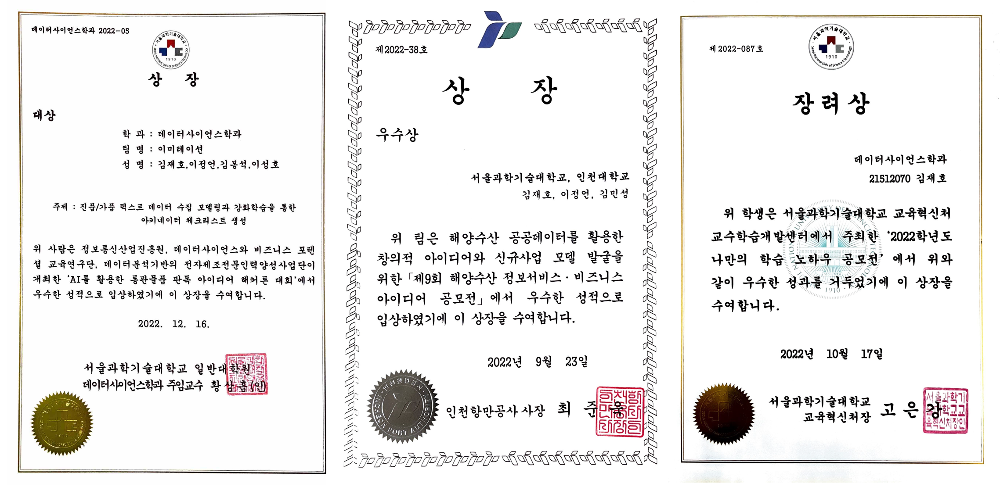

## 📂 <a href='https://github.com/countifs/portfolio'> BK21 테크니컬 포트폴리오 </a> : 데이터 활용 및 분석

 

### 🚩 심사항목
| No. | 심사항목 | 내용 | 기타 |
|:----------:|----------|----------|----------|
|1|데이터사이언스 공통| Python, SQL, R, Java, Scala, Go, C/C++, Javascript 등 데이터 처리 언어 활용 능력  |<a href='https://github.com/countifs/portfolio/tree/main/1.%20%EB%8D%B0%EC%9D%B4%ED%84%B0%EC%82%AC%EC%9D%B4%EC%96%B8%EC%8A%A4%20%EA%B3%B5%ED%86%B5'>바로가기</a>|
|**2**|**데이터 활용 및 분석**| **데이터사이언스 관련 공모전 참여를 통한 공개 데이터의 활용 및 분석 능력**  |<a href='https://github.com/countifs/portfolio/tree/main/2.%20%EB%8D%B0%EC%9D%B4%ED%84%B0%20%ED%99%9C%EC%9A%A9%20%EB%B0%8F%20%EB%B6%84%EC%84%9D'>바로가기</a>|
|3|데이터 시각화| Tableau, Power BI 등을 활용한 데이터 시각화 능력  |<a href='https://github.com/countifs/portfolio/tree/main/3.%20%EB%8D%B0%EC%9D%B4%ED%84%B0%20%EC%8B%9C%EA%B0%81%ED%99%94'>바로가기</a>|

 

### 🏆 공모전 참여

| No. | 기간 | 공모전 | 수상 | 비고 |
|:----------:|:--------:|-----------|:----------:|:----------:|
| 1 | 2022.07 | <a href='https://www.seoultech.ac.kr/service/info/news/?do=commonview&searchtext=%EA%B9%80%EC%9E%AC%ED%98%B8&searchtype=1&nowpage=1&bnum=3596&bidx=523629&cate=14'>제9회 '해양수산 정보서비스ㆍ비즈니스 아이디어 공모전' - 빅데이터부문</a> | 우수상 | <a href='https://github.com/countifs/portfolio/blob/main/2.%20%EB%8D%B0%EC%9D%B4%ED%84%B0%20%ED%99%9C%EC%9A%A9%20%EB%B0%8F%20%EB%B6%84%EC%84%9D/1.%20%EC%A0%9C9%ED%9A%8C%20%ED%95%B4%EC%96%91%EC%88%98%EC%82%B0%20%EC%A0%95%EB%B3%B4%EC%84%9C%EB%B9%84%EC%8A%A4%E3%86%8D%EB%B9%84%EC%A6%88%EB%8B%88%EC%8A%A4%20%EC%95%84%EC%9D%B4%EB%94%94%EC%96%B4%20%EA%B3%B5%EB%AA%A8%EC%A0%84/%5B%EB%B9%85%EB%8D%B0%EC%9D%B4%ED%84%B0%EB%B6%84%EC%84%9D%EB%B6%80%EB%AC%B8%5D%20%EC%9C%A0%EC%82%AC%EC%96%B4%EC%A2%85%EC%9D%98%20%EC%9D%B4%EB%AF%B8%EC%A7%80%20%EB%B6%84%EB%A5%98%EB%A5%BC%20%ED%86%B5%ED%95%9C%20%EC%88%98%EC%82%B0%EB%AC%BC%20%EA%B1%B0%EB%9E%98%20%EC%8B%9C%EC%9E%A5%EC%9D%98%20%EC%A0%95%EB%B3%B4%EB%B9%84%EB%8C%80%EC%B9%AD%20%EA%B0%9C%EC%84%A0%20%EB%B0%9C%ED%91%9C%EC%9E%90%EB%A3%8C.pdf'>바로가기</a> |
| 2 | 2022.10 | 서울과학기술대학교 교육혁신처 교수학습개발센터 - '나만의 학습 노하우 공모전' | 장려상 | <a href='https://github.com/countifs/portfolio/blob/main/2.%20%EB%8D%B0%EC%9D%B4%ED%84%B0%20%ED%99%9C%EC%9A%A9%20%EB%B0%8F%20%EB%B6%84%EC%84%9D/2.%20%EB%82%98%EB%A7%8C%EC%9D%98%20%ED%95%99%EC%8A%B5%20%EB%85%B8%ED%95%98%EC%9A%B0%20%EA%B3%B5%EB%AA%A8%EC%A0%84/%EB%82%98%EB%A7%8C%EC%9D%98%20%ED%95%99%EC%8A%B5%20%EB%85%B8%ED%95%98%EC%9A%B0%20%EA%B3%B5%EB%AA%A8%EC%A0%84_%EB%8D%B0%EC%9D%B4%ED%84%B0%EC%82%AC%EC%9D%B4%EC%96%B8%EC%8A%A4%ED%95%99%EA%B3%BC_%EA%B9%80%EC%9E%AC%ED%98%B8(21512070).pdf'>바로가기</a> |
| 3 | 2022.12 | 정보통신산업진흥원, 데이터사이언스와 비즈니스 포텐셜 교육연구단 ,  데이터분석기반의  전자제조전문인력양성사업단 - 'AI를 활용한 통관물품 판독 아이디어 해커톤' | 대상 | <a href='https://github.com/countifs/portfolio/blob/main/2.%20%EB%8D%B0%EC%9D%B4%ED%84%B0%20%ED%99%9C%EC%9A%A9%20%EB%B0%8F%20%EB%B6%84%EC%84%9D/3.%20AI%EB%A5%BC%20%ED%99%9C%EC%9A%A9%ED%95%9C%20%ED%86%B5%EA%B4%80%EB%AC%BC%ED%92%88%20%ED%8C%90%EB%8F%85%20%EC%95%84%EC%9D%B4%EB%94%94%EC%96%B4%20%ED%95%B4%EC%BB%A4%ED%86%A4/AI%EB%A5%BC%20%ED%99%9C%EC%9A%A9%ED%95%9C%20%ED%86%B5%EA%B4%80%EB%AC%BC%ED%92%88%20%ED%8C%90%EB%8F%85%20%EC%95%84%EC%9D%B4%EB%94%94%EC%96%B4%20%ED%95%B4%EC%BB%A4%ED%86%A4%20-%20%EC%9D%B4%EB%AF%B8%ED%85%8C%EC%9D%B4%EC%85%98(g%EA%B7%B8%EB%A3%B9).pdf'>바로가기</a> |
| 4 | 2022.10 | 2022년 K-인공지능 제조데이터 분석 경진대회  (KAMP)           | - | <a href='https://github.com/countifs/portfolio/blob/main/2.%20%EB%8D%B0%EC%9D%B4%ED%84%B0%20%ED%99%9C%EC%9A%A9%20%EB%B0%8F%20%EB%B6%84%EC%84%9D/4.%202022%EB%85%84%20K-%EC%9D%B8%EA%B3%B5%EC%A7%80%EB%8A%A5%20%EC%A0%9C%EC%A1%B0%EB%8D%B0%EC%9D%B4%ED%84%B0%20%EB%B6%84%EC%84%9D%20%EA%B2%BD%EC%A7%84%EB%8C%80%ED%9A%8C/KAMP%20%EB%B6%84%EC%84%9D%20%EA%B2%B0%EA%B3%BC%EB%B3%B4%EA%B3%A0%EC%84%9C%20PPT%20-%20%ED%8C%A8%EC%8A%A4%EC%9B%8C%EB%93%9C%ED%8C%80.pdf'>바로가기</a> |

 

 

 
