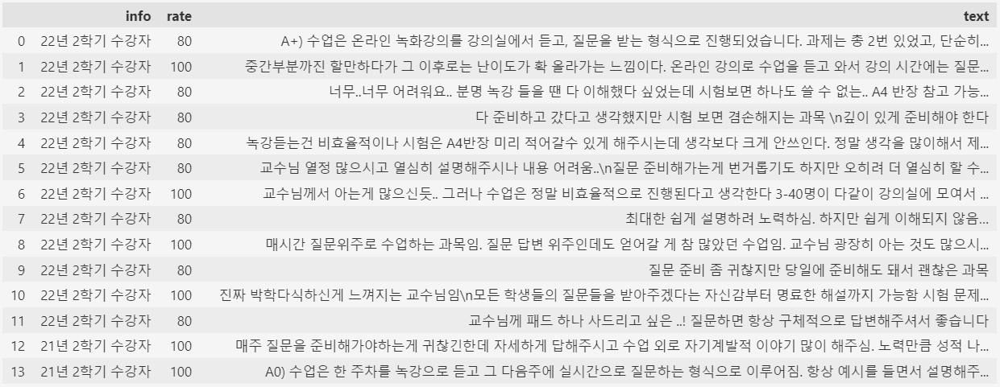
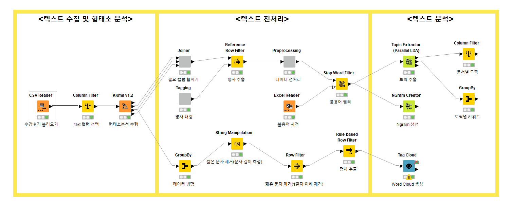

<br>

## 📌 KNIME 솔루션을 활용한 개인 프로젝트 : 에타 수강후기 분석 및 워드 클라우드 시각화


#### 1. 데이터 수집 (리뷰가 많지 않아서 크롤링은 사용하지 않고 웹페이지 HTML 복사하여 txt파일로 저장)

```
- 에타 접속 (https://everytime.kr/) 생략가능, 로그인으로 바로 이동
- 에타 로그인 (https://everytime.kr/login)
- 에타 강의실 페이지로 이동 (https://everytime.kr/lecture)
- 에타 강의 평가 이동 (https://everytime.kr/lecture/view/930295)
- 에타 강의 평가 통계처리 입문 (https://everytime.kr/lecture/view/930295?tab=article)
```


#### 2. 모듈 불러오기

```python
import requests
from bs4 import BeautifulSoup

import selenium
from selenium import webdriver
from selenium.webdriver.chrome.service import Service
from selenium.webdriver.chrome.options import Options
from selenium.webdriver.common.by import By 

# 크롬 드라이버 자동 업데이트
from webdriver_manager.chrome import ChromeDriverManager

import time
import random 
import pyautogui
import pyperclip

import pandas as pd
```


#### 3. txt파일 불러오기 및  html 파싱

```python
# txt파일 불러오기
with open('통계처리입문.txt', 'r', encoding='utf-8') as f:
    text = f.read()

soup = BeautifulSoup(text, 'html.parser')
articles = soup.select('div.article')
texts = soup.select('div.text')
rates = soup.select('span.on')
infos = soup.select('span.semester')
# articles = soup.find_all('div', class_='article')

info_list = []
rate_list = []
text_list = []

i = 1
 
for info, rate, text in zip(infos, rates, texts):
    info_list.append(info.text.strip() )
    rate_list.append(rate['style'] )
    text_list.append(text.text.strip() )
    i += 1 
    
rate_list = [rate.split(':')[1].strip() for rate in rate_list]
rate_list = [rate.split('%')[0] for rate in rate_list]   

everytime_hong = pd.DataFrame({'info':info_list, 'rate':rate_list, 'text':text_list})
everytime_hong
```




#### 4. KNIME 솔루션을 활용한 텍스트 데이터 분석 및 워드 클라우드 시각화




<br>
<br>
