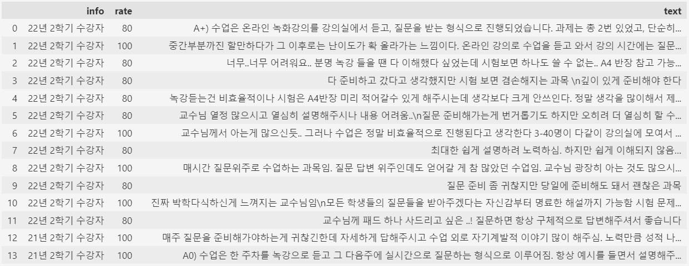
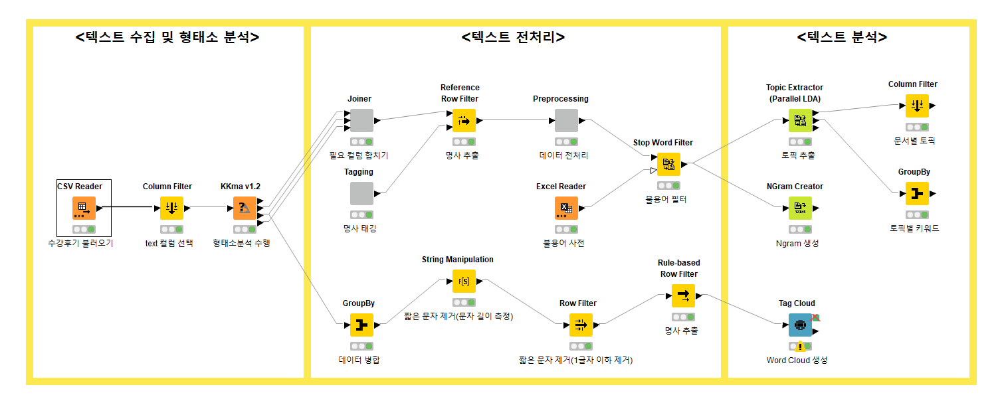

## 📂 <a href='https://github.com/countifs/portfolio'> BK21 테크니컬 포트폴리오 </a> : 데이터 시각화

<br>

### 🚩 심사항목

|  No.  | 심사항목            | 내용                                                         | 기타                                                         |
| :---: | ------------------- | ------------------------------------------------------------ | ------------------------------------------------------------ |
|   1   | 데이터사이언스 공통 | Python, SQL, R, Java, Scala, Go, C/C++, Javascript 등 데이터 처리 언어 활용 능력 | <a href='https://github.com/countifs/portfolio/tree/main/1.%20%EB%8D%B0%EC%9D%B4%ED%84%B0%EC%82%AC%EC%9D%B4%EC%96%B8%EC%8A%A4%20%EA%B3%B5%ED%86%B5'>바로가기</a> |
|   2   | 데이터 활용 및 분석 | 데이터사이언스 관련 공모전 참여를 통한 공개 데이터의 활용 및 분석 능력 | <a href='https://github.com/countifs/portfolio/tree/main/2.%20%EB%8D%B0%EC%9D%B4%ED%84%B0%20%ED%99%9C%EC%9A%A9%20%EB%B0%8F%20%EB%B6%84%EC%84%9D'>바로가기</a> |
| **3** | **데이터 시각화**   | **Tableau, Power BI 등을 활용한 데이터 시각화 능력**         | <a href='https://github.com/countifs/portfolio/tree/main/3.%20%EB%8D%B0%EC%9D%B4%ED%84%B0%20%EC%8B%9C%EA%B0%81%ED%99%94'>바로가기</a> |

<br>

### ✏️ 교육훈련 이력 (실습결과 첨부)

| No.  |   구분   |                           교육기관                           |       기간        |                   과정명                   |  비고  |
| :--: | :------: | :----------------------------------------------------------: | :---------------: | :----------------------------------------: | :----: |
|  1   | 정규과정 |                        서울과학기술대                        | 2021.03 ~ 2021.06 | 데이터 시각화 (IT정책대학원 - 김자희 교수) | <a href='https://github.com/countifs/portfolio/blob/main/3.%20%EB%8D%B0%EC%9D%B4%ED%84%B0%20%EC%8B%9C%EA%B0%81%ED%99%94/1.%20%EB%8D%B0%EC%9D%B4%ED%84%B0%20%EC%8B%9C%EA%B0%81%ED%99%94%20(IT%EC%A0%95%EC%B1%85%EB%8C%80%ED%95%99%EC%9B%90%20-%20%EA%B9%80%EC%9E%90%ED%9D%AC%20%EA%B5%90%EC%88%98)/%EB%8D%B0%EC%9D%B4%ED%84%B0%EC%8B%9C%EA%B0%81%ED%99%94%20%ED%94%84%EB%A1%9C%EC%A0%9D%ED%8A%B8_%EA%B9%80%EC%9E%AC%ED%98%B8(21512070).pdf'>바로가기</a>|
|  2   | 외부교육 |                            태블로                            | 2022.03 ~ 2022.04 |    태블로(Tableau) 신병훈련소 13기 과정    | <a href='https://github.com/countifs/portfolio/blob/main/3.%20%EB%8D%B0%EC%9D%B4%ED%84%B0%20%EC%8B%9C%EA%B0%81%ED%99%94/2.%20%ED%83%9C%EB%B8%94%EB%A1%9C(Tableau)%20%EC%8B%A0%EB%B3%91%ED%9B%88%EB%A0%A8%EC%86%8C%2013%EA%B8%B0%20(22.03.18%20~%2022.04.01)/%ED%83%9C%EB%B8%94%EB%A1%9C%20%EC%8B%A0%EB%B3%91%ED%9B%88%EB%A0%A8%EC%86%8C%20%EC%8B%A4%EC%8A%B5%EA%B2%B0%EA%B3%BC.pdf'>바로가기</a> |
|  3   | 외부교육 |                            Udemy                             |    2022.11.22     |     파워BI를 활용한 데이터 시각화 기초     | <a href='https://github.com/countifs/portfolio/blob/main/3.%20%EB%8D%B0%EC%9D%B4%ED%84%B0%20%EC%8B%9C%EA%B0%81%ED%99%94/3.%20%ED%8C%8C%EC%9B%8CBI%EB%A5%BC%20%ED%99%9C%EC%9A%A9%ED%95%9C%20%EB%8D%B0%EC%9D%B4%ED%84%B0%20%EC%8B%9C%EA%B0%81%ED%99%94%20%EA%B8%B0%EC%B4%88/Udemy%20-%20(%EC%8B%A4%EC%8A%B5)%20%ED%8C%8C%EC%9B%8CBI%EB%A5%BC%20%ED%99%9C%EC%9A%A9%ED%95%9C%20%EB%8D%B0%EC%9D%B4%ED%84%B0%20%EC%8B%9C%EA%B0%81%ED%99%94%20%EA%B8%B0%EC%B4%88.pdf'>바로가기</a> |
|  4   | 외부교육 |                            러닝핏                            | 2022.10 ~ 2022.11 |      Power BI로 배우는 데이터 시각화       | - |
|  5   |  유튜브  | <a href='https://www.youtube.com/@citizendeveloper3327/playlists'>시민개발자</a> | 2022.12 ~ 2023.01 | 파워비아이 배움터2(심화)  | <a href='https://github.com/countifs/portfolio/blob/main/3.%20%EB%8D%B0%EC%9D%B4%ED%84%B0%20%EC%8B%9C%EA%B0%81%ED%99%94/5.%20%EC%8B%9C%EB%AF%BC%EA%B0%9C%EB%B0%9C%EC%9E%90%20-%20%ED%8C%8C%EC%9B%8C%EB%B9%84%EC%95%84%EC%9D%B4%20%EB%B0%B0%EC%9B%80%ED%84%B02(%EC%8B%AC%ED%99%94)/%EC%8B%A4%EC%8A%B5.pdf'>바로가기</a> |
|  6   |  유튜브  | <a href='https://www.youtube.com/@ONION-BI'>어니언 비아이 (ONION BI)</a> | 2022.11 ~ 2022.12 | 오리지널 DAX 시리즈| <a href='https://github.com/countifs/portfolio/blob/main/3.%20%EB%8D%B0%EC%9D%B4%ED%84%B0%20%EC%8B%9C%EA%B0%81%ED%99%94/6.%20%EC%96%B4%EB%8B%88%EC%96%B8%EB%B9%84%EC%95%84%EC%9D%B4-%EC%98%A4%EB%A6%AC%EC%A7%80%EB%84%90%20DAX%20%EC%8B%9C%EB%A6%AC%EC%A6%88/%EC%96%B4%EB%8B%88%EC%96%B8%20%EB%B9%84%EC%95%84%EC%9D%B4%20-%20(%EC%8B%A4%EC%8A%B5)%20%EC%98%A4%EB%A6%AC%EC%A7%80%EB%84%90%20DAX%20%EC%8B%9C%EB%A6%AC%EC%A6%88.pdf'>바로가기</a> |
| 7 | 외부교육 | 전자제조센터 (KEA) | 2022.08 | 텍스트 마이닝 (KNIME 활용) | - |
| 8 | 외부교육 | 전자제조센터  (KEA) | 2023.01 | AI응용 및 데이터융합실습 (MS Azure & KNIME 활용) | - |

<br>

### 📈 KNIME 솔루션을 활용한 데이터 분석 및 시각화

- <a href='https://lungfish.tistory.com/'> 티스토리 - 물 만날 물고기</a> (운영중인 블로그 포스팅을 참고하시기 바랍니다.)

| No. | 구분 | 포스팅 | 비고 |
|:---------:|:---------:|---------|:---------:|
| 1 | KNIME | <a href='https://lungfish.tistory.com/entry/KNIME%EB%82%98%EC%9E%84-Node-Round-Double-%EC%86%8C%EC%88%98%EC%A0%90-%EC%9E%90%EB%A6%AC%EB%A5%BC-%EB%B3%80%EA%B2%BD%ED%95%A0-%EB%95%8C'>[KNIME] Node - "Round Double" 소수점 자리를 변경할 때</a> |- |
| 2 | KNIME | <a href='https://lungfish.tistory.com/entry/KNIME%EB%82%98%EC%9E%84-Workflow-%EB%8D%B0%EC%9D%B4%ED%84%B0%EC%85%8B%EC%97%90-%ED%8A%B9%EC%A0%95-%EB%AC%B8%EC%9E%90%EC%97%B4%EB%A1%9C-%EC%BB%AC%EB%9F%BC%EC%9D%84-%EC%B6%94%EA%B0%80%ED%95%98%EA%B3%A0-%EC%8B%B6%EC%9D%84-%EB%95%8C'>[KNIME] Workflow - 데이터셋에 특정 문자열로 컬럼을 추가하고 싶을 때</a> |- |
| 3 | KNIME | <a href='https://lungfish.tistory.com/entry/KNIME%EB%82%98%EC%9E%84-Workflow-%EC%9D%98%EC%82%AC%EA%B2%B0%EC%A0%95%EB%82%98%EB%AC%B4Decision-Tree%EB%A5%BC-%EC%9D%B4%EC%9A%A9%ED%95%9C-UCI-%EC%9C%A0%EB%B0%A9%EC%95%94Breast-Cancer-%EB%8D%B0%EC%9D%B4%ED%84%B0-%EB%B6%84%EC%84%9D'>[KNIME] Workflow - 의사결정나무(Decision Tree)를 이용한 UCI 유방암(Breast Cancer) 데이터 분석</a> |- |
| 4 | KNIME | <a href='https://lungfish.tistory.com/entry/KNIME-Setting-Memory-%ED%95%A0%EB%8B%B9-%EB%B3%80%EA%B2%BD%ED%95%98%EA%B8%B0-RAM-%EB%A9%94%EB%AA%A8%EB%A6%AC-%EC%A6%9D%EA%B0%80-%EA%B0%90%EC%86%8C'>[KNIME] Setting - Memory 할당 변경하기 (RAM 메모리 증가, 감소)</a> |- |
| 5 | KNIME | <a href='https://lungfish.tistory.com/entry/KNIME-Workflow-%EA%B0%81-%ED%96%89%EC%9D%B8%EB%8D%B1%EC%8A%A4-%ED%95%A9%EA%B3%84%EB%A5%BC-%EA%B3%84%EC%82%B0%ED%95%98%EA%B3%A0-%EC%BB%AC%EB%9F%BC-%EC%B6%94%EA%B0%80%ED%95%98%EA%B8%B0'>[KNIME] Workflow - 각 행(인덱스)별 합계 컬럼 추가하기</a> |- |
| 6 | KNIME | <a href='https://lungfish.tistory.com/entry/KNIME-Workflow-Missing-Value%EA%B2%B0%EC%B8%A1%EC%B9%98-%ED%99%95%EC%9D%B8-%EB%B0%8F-%EC%B2%98%EB%A6%AC%ED%95%98%EA%B8%B0'>[KNIME] Workflow - Missing Value(결측치) 확인 및 처리하기</a> |- |
| 7 | KNIME | <a href='https://lungfish.tistory.com/entry/KNIME-Node-Nuemeric-Binner-%EC%97%B0%EC%86%8D%ED%98%95-%EB%B3%80%EC%88%98%EB%A5%BC-%EB%B2%94%EC%A3%BC%ED%99%94-%ED%95%98%EA%B3%A0-%EC%8B%B6%EC%9D%84-%EB%95%8C-%EA%B5%AC%EA%B0%84%ED%99%94-Binning'>[KNIME] Node - "Nuemeric Binner" 연속형 변수를 범주화 하고 싶을 때 (구간화 Binning)</a> |- |
| 8 | KNIME | <a href='https://lungfish.tistory.com/entry/KNIME-Workflow-%EB%8D%B0%EC%9D%B4%ED%84%B0%EC%85%8B%EC%97%90-%ED%8A%B9%EC%A0%95-%EB%AC%B8%EC%9E%90%EC%97%B4%EB%A1%9C-%EC%BB%AC%EB%9F%BC%EC%9D%84-%EC%B6%94%EA%B0%80%ED%95%98%EA%B3%A0-%EC%8B%B6%EC%9D%84-%EB%95%8C-2%ED%8E%B8-Constant-Value-Column-%EB%85%B8%EB%93%9C'>[KNIME] Workflow - 데이터셋에 특정 문자열로 컬럼을 추가하고 싶을 때 - 2편 (Constant Value Column 노드)</a> |- |


<br>


### 📌 [사이드 프로젝트] KNIME 솔루션을 활용한 에타 수강후기 분석 및 워드 클라우드 시각화


#### 1. 데이터 수집 (리뷰가 많지 않아서 크롤링은 사용하지 않고 웹페이지 HTML 복사하여 txt파일로 저장)

```
- 에타 접속 (https://everytime.kr/) 생략가능, 로그인으로 바로 이동
- 에타 로그인 (https://everytime.kr/login)
- 에타 강의실 페이지로 이동 (https://everytime.kr/lecture)
- 에타 강의 평가 이동 (https://everytime.kr/lecture/view/930295)
- 에타 강의 평가 통계처리 입문 (https://everytime.kr/lecture/view/930295?tab=article)
```


#### 2. 모듈 불러오기

```python
import requests
from bs4 import BeautifulSoup

import selenium
from selenium import webdriver
from selenium.webdriver.chrome.service import Service
from selenium.webdriver.chrome.options import Options
from selenium.webdriver.common.by import By 

# 크롬 드라이버 자동 업데이트
from webdriver_manager.chrome import ChromeDriverManager

import time
import random 
import pyautogui
import pyperclip

import pandas as pd
```


#### 3. txt파일 불러오기 및  html 파싱

```python
# txt파일 불러오기
with open('통계처리입문.txt', 'r', encoding='utf-8') as f:
    text = f.read()

soup = BeautifulSoup(text, 'html.parser')
articles = soup.select('div.article')
texts = soup.select('div.text')
rates = soup.select('span.on')
infos = soup.select('span.semester')
# articles = soup.find_all('div', class_='article')

info_list = []
rate_list = []
text_list = []

i = 1
 
for info, rate, text in zip(infos, rates, texts):
    info_list.append(info.text.strip() )
    rate_list.append(rate['style'] )
    text_list.append(text.text.strip() )
    i += 1 
    
rate_list = [rate.split(':')[1].strip() for rate in rate_list]
rate_list = [rate.split('%')[0] for rate in rate_list]   

everytime_hong = pd.DataFrame({'info':info_list, 'rate':rate_list, 'text':text_list})
everytime_hong
```




#### 4. KNIME 솔루션을 활용한 텍스트 데이터 분석 및 워드 클라우드 시각화




<br>
<br>

