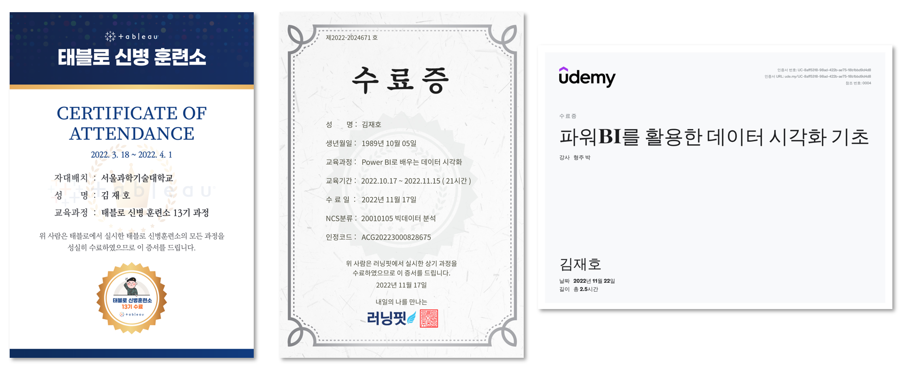

## 📂 <a href='https://github.com/countifs/portfolio'> BK21 테크니컬 포트폴리오 </a> : 데이터 시각화

 

### 🚩 심사항목

|  No.  | 심사항목            | 내용                                                         | 기타                                                         |
| :---: | ------------------- | ------------------------------------------------------------ | ------------------------------------------------------------ |
|   1   | 데이터사이언스 공통 | Python, SQL, R, Java, Scala, Go, C/C++, Javascript 등 데이터 처리 언어 활용 능력 | <a href='https://github.com/countifs/portfolio/tree/main/1.%20%EB%8D%B0%EC%9D%B4%ED%84%B0%EC%82%AC%EC%9D%B4%EC%96%B8%EC%8A%A4%20%EA%B3%B5%ED%86%B5'>바로가기</a> |
|   2   | 데이터 활용 및 분석 | 데이터사이언스 관련 공모전 참여를 통한 공개 데이터의 활용 및 분석 능력 | <a href='https://github.com/countifs/portfolio/tree/main/2.%20%EB%8D%B0%EC%9D%B4%ED%84%B0%20%ED%99%9C%EC%9A%A9%20%EB%B0%8F%20%EB%B6%84%EC%84%9D'>바로가기</a> |
| **3** | **데이터 시각화**   | **Tableau, Power BI 등을 활용한 데이터 시각화 능력**         | <a href='https://github.com/countifs/portfolio/tree/main/3.%20%EB%8D%B0%EC%9D%B4%ED%84%B0%20%EC%8B%9C%EA%B0%81%ED%99%94'>바로가기</a> |

 

### ✏️ 교육훈련 이력 (실습결과 첨부)

| No.  |   구분   |                           교육기관                           |       기간        |                   과정명                   |  비고  |
| :--: | :------: | :----------------------------------------------------------: | :---------------: | :----------------------------------------: | :----: |
|  1   | 정규과정 |                        서울과학기술대                        | 2021.03 ~ 2021.06 | 데이터 시각화 (IT정책대학원 - 김자희 교수) | <a href='https://github.com/countifs/portfolio/blob/main/3.%20%EB%8D%B0%EC%9D%B4%ED%84%B0%20%EC%8B%9C%EA%B0%81%ED%99%94/1.%20%EB%8D%B0%EC%9D%B4%ED%84%B0%20%EC%8B%9C%EA%B0%81%ED%99%94%20(IT%EC%A0%95%EC%B1%85%EB%8C%80%ED%95%99%EC%9B%90%20-%20%EA%B9%80%EC%9E%90%ED%9D%AC%20%EA%B5%90%EC%88%98)/%EB%8D%B0%EC%9D%B4%ED%84%B0%EC%8B%9C%EA%B0%81%ED%99%94%20%ED%94%84%EB%A1%9C%EC%A0%9D%ED%8A%B8_%EA%B9%80%EC%9E%AC%ED%98%B8(21512070).pdf'>바로가기</a>|
|  2   | 외부교육 |                            태블로                            | 2022.03 ~ 2022.04 |    태블로(Tableau) 신병훈련소 13기 과정    | <a href='https://github.com/countifs/portfolio/blob/main/3.%20%EB%8D%B0%EC%9D%B4%ED%84%B0%20%EC%8B%9C%EA%B0%81%ED%99%94/2.%20%ED%83%9C%EB%B8%94%EB%A1%9C(Tableau)%20%EC%8B%A0%EB%B3%91%ED%9B%88%EB%A0%A8%EC%86%8C%2013%EA%B8%B0%20(22.03.18%20~%2022.04.01)/%ED%83%9C%EB%B8%94%EB%A1%9C%20%EC%8B%A0%EB%B3%91%ED%9B%88%EB%A0%A8%EC%86%8C%20%EC%8B%A4%EC%8A%B5%EA%B2%B0%EA%B3%BC.pdf'>바로가기</a> |
|  3   | 외부교육 |                            Udemy                             |    2022.11.22     |     파워BI를 활용한 데이터 시각화 기초     | <a href='https://github.com/countifs/portfolio/blob/main/3.%20%EB%8D%B0%EC%9D%B4%ED%84%B0%20%EC%8B%9C%EA%B0%81%ED%99%94/3.%20%ED%8C%8C%EC%9B%8CBI%EB%A5%BC%20%ED%99%9C%EC%9A%A9%ED%95%9C%20%EB%8D%B0%EC%9D%B4%ED%84%B0%20%EC%8B%9C%EA%B0%81%ED%99%94%20%EA%B8%B0%EC%B4%88/Udemy%20-%20(%EC%8B%A4%EC%8A%B5)%20%ED%8C%8C%EC%9B%8CBI%EB%A5%BC%20%ED%99%9C%EC%9A%A9%ED%95%9C%20%EB%8D%B0%EC%9D%B4%ED%84%B0%20%EC%8B%9C%EA%B0%81%ED%99%94%20%EA%B8%B0%EC%B4%88.pdf'>바로가기</a> |
|  4   | 외부교육 |                            러닝핏                            | 2022.10 ~ 2022.11 |      Power BI로 배우는 데이터 시각화       | - |
|  5   |  유튜브  | <a href='https://www.youtube.com/@citizendeveloper3327/playlists'>시민개발자</a> | 2022.12 ~ 2023.01 | 파워비아이 배움터2(심화)  | <a href='https://github.com/countifs/portfolio/blob/main/3.%20%EB%8D%B0%EC%9D%B4%ED%84%B0%20%EC%8B%9C%EA%B0%81%ED%99%94/5.%20%EC%8B%9C%EB%AF%BC%EA%B0%9C%EB%B0%9C%EC%9E%90%20-%20%ED%8C%8C%EC%9B%8C%EB%B9%84%EC%95%84%EC%9D%B4%20%EB%B0%B0%EC%9B%80%ED%84%B02(%EC%8B%AC%ED%99%94)/%EC%8B%A4%EC%8A%B5.pdf'>바로가기</a> |
|  6   |  유튜브  | <a href='https://www.youtube.com/@ONION-BI'>어니언 비아이 (ONION BI)</a> | 2022.11 ~ 2022.12 | 오리지널 DAX 시리즈| <a href='https://github.com/countifs/portfolio/blob/main/3.%20%EB%8D%B0%EC%9D%B4%ED%84%B0%20%EC%8B%9C%EA%B0%81%ED%99%94/6.%20%EC%96%B4%EB%8B%88%EC%96%B8%EB%B9%84%EC%95%84%EC%9D%B4-%EC%98%A4%EB%A6%AC%EC%A7%80%EB%84%90%20DAX%20%EC%8B%9C%EB%A6%AC%EC%A6%88/%EC%96%B4%EB%8B%88%EC%96%B8%20%EB%B9%84%EC%95%84%EC%9D%B4%20-%20(%EC%8B%A4%EC%8A%B5)%20%EC%98%A4%EB%A6%AC%EC%A7%80%EB%84%90%20DAX%20%EC%8B%9C%EB%A6%AC%EC%A6%88.pdf'>바로가기</a> |
| 7 | 외부교육 | 전자제조센터 (KEA) | 2022.08 | 텍스트 마이닝 (KNIME 활용) | - |
| 8 | 외부교육 | 전자제조센터  (KEA) | 2023.01 | AI응용 및 데이터융합실습 (MS Azure & KNIME 활용) | - |

 

